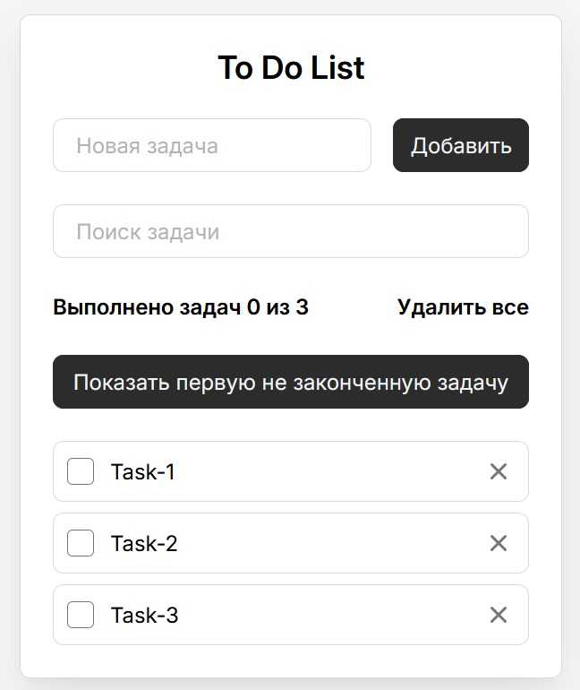

# ToDo-React


ToDo-React — это простое приложение для управления задачами, созданное с использованием React. Это приложение позволяет добавлять, удалять и помечать задачи как выполненные. Идеально подходит для тех, кто хочет научиться работать с базовыми функциями React.

## Описание

Приложение ToDo-React предназначено для демонстрации основных возможностей React, таких как создание компонентов, использование состояний и событий. Это базовый проект, подходящий для начинающих, которые хотят понять, как строить простые веб-приложения с помощью React.

## Функциональные возможности

- Добавление новых задач
- Удаление задач
- Отметка задач как выполненные
- Сохранение задач в локальном хранилище (LocalStorage)

## Технологии

- **React** — основная библиотека для построения пользовательского интерфейса
- **JavaScript (ES6+)** — язык программирования
- **CSS** — для стилизации
- **LocalStorage** — для сохранения задач между перезагрузками страницы

## Установка

Для того чтобы запустить проект локально, выполните следующие шаги:

1. Клонируйте репозиторий:

   ```bash
   git clone https://github.com/Funk2256/ToDo-React.git
2. Перейдите в директорию проекта:
    ```bash
    cd ToDo-React
3. Установите зависимости:
   Чтобы установить все необходимые зависимости, используйте команду:
    ```bash
    npm install
4. Запустите приложение:
   После того как все зависимости будут установлены, запустите приложение командой:
   ```bash
    npm run dev

Проект для предмета "Web-технологии".

Студента группы РИЗ-339016у. 
Крашенинников А.Д.

